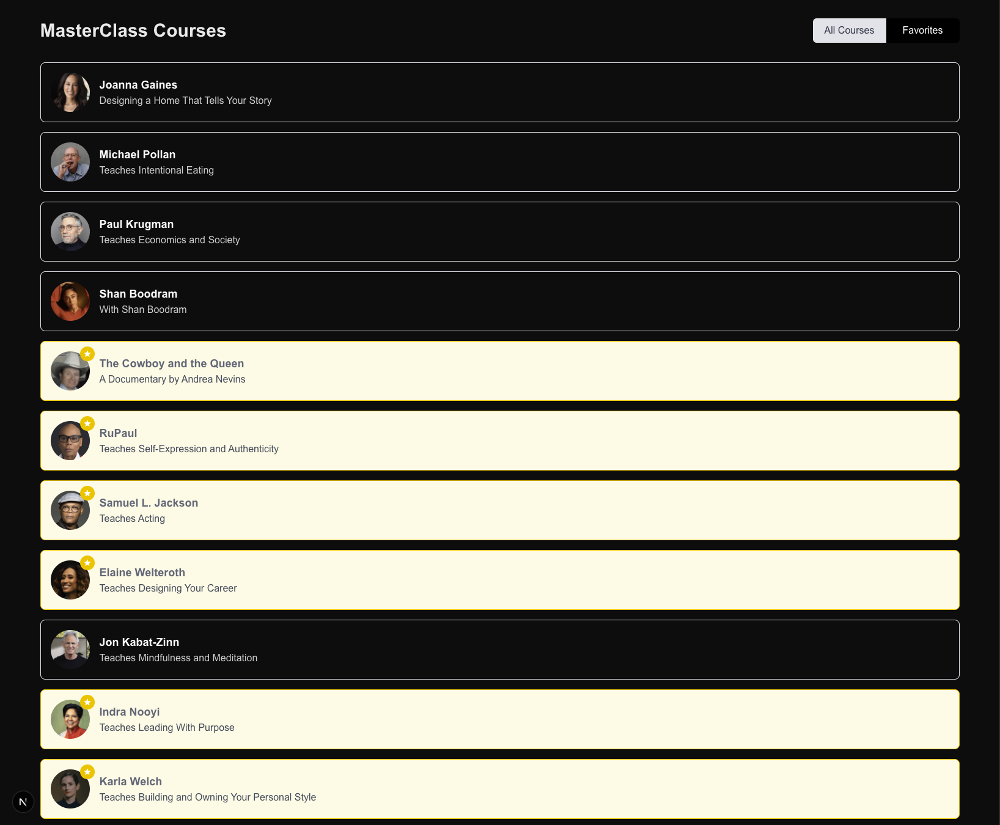
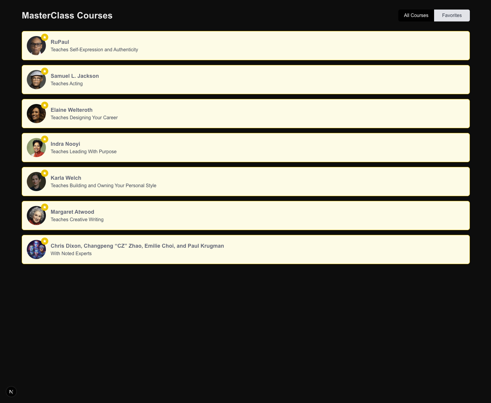
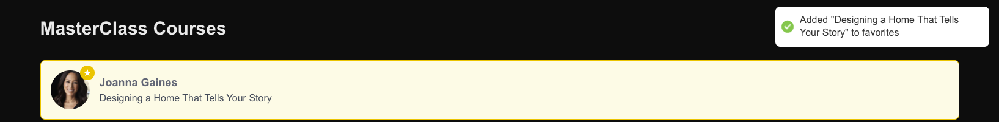
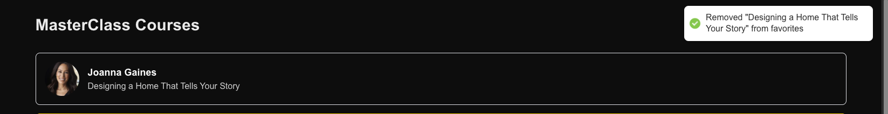
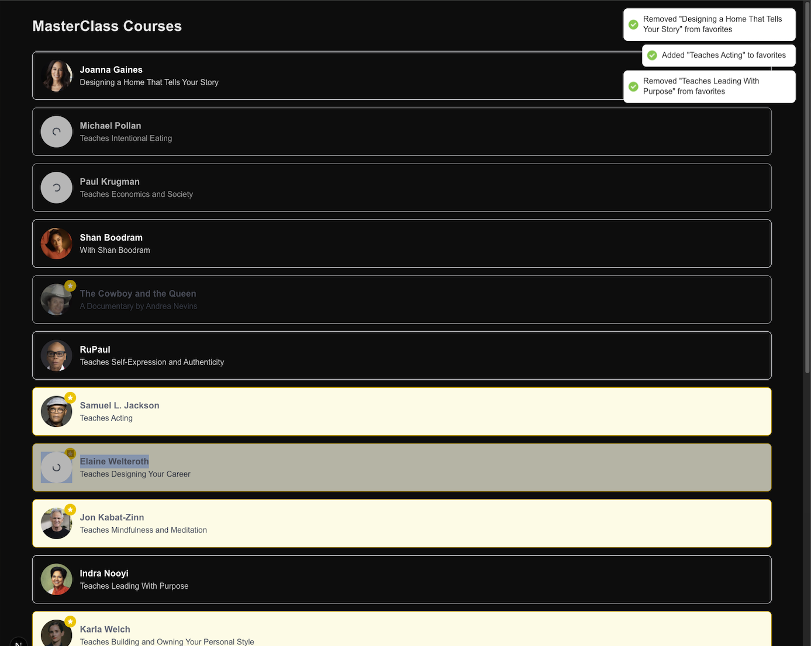

# MasterClass Courses

A Next.js application that displays MasterClass courses and allows users to manage their favorites.

## Features

- Course catalog with instructor information
- Add/remove favorites functionality with visual indicators
- Filter between all courses and favorites
- Responsive design with visual polish
- Loading indicators and toast notifications

## Screenshots

### Course Listing



### Favorites View



### Add Favorite



### Remove Favorite



### Processing Multiple



## Getting Started

### Prerequisites

- Node.js 18+ and npm/yarn

### Installation

1. Clone the repository
2. Install dependencies:

```bash
npm install
# or
yarn install
```

3. Run the development server:

```bash
npm run dev
# or
yarn dev
```

4. Open [http://localhost:3000](http://localhost:3000) in your browser

## Tech Stack

- **Next.js**: React framework
- **Tailwind CSS**: For styling
- **React Hot Toast**: For notifications

## Project Structure

```
my-courses-manuel/
  ├── app/               # Next.js app directory
  │   ├── courses/       # Courses page
  │   ├── api/           # API routes
  │   ├── layout.js      # App layout
  │   ├── page.js        # Home page
  │   ├── types/         # TypeScript types
  │   └── components/    # Shared components
  ├── .screenshots/      # Screenshots for README
  └── public/            # Static assets
```

## Future Improvements

Given more time, I would implement:

- Server-side rendering for initial page load to improve LCP (Largest Contentful Paint)
- Caching strategy with 1-hour TTL to reduce API calls
- Responsive design for all screen sizes
- Infinite scroll pagination for better UX with large datasets
- Image preloading for visible course instructors
- Offline mode using service workers
- Integration tests to ensure functionality works correctly
- AB testing setup to measure the effectiveness of UX changes

## Accessibility Features

- Proper semantic HTML structure
- Keyboard navigation support
- Accessible color contrast
- ARIA labels for interactive elements
